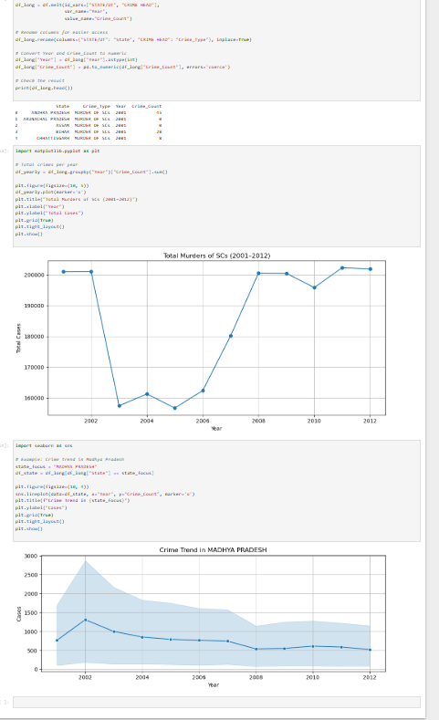
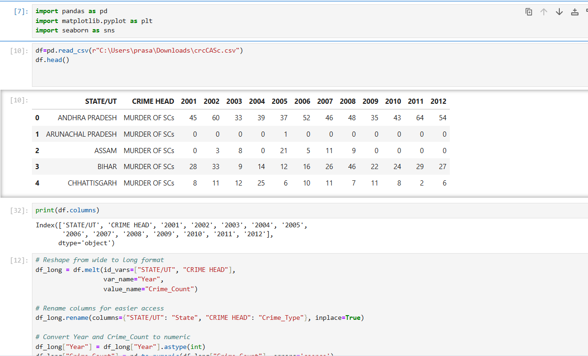

📊 Crime Data Analysis in India (2001–2012)

This project analyzes crime trends in India focused on Scheduled Caste-related crimes using Power BI and Python. It includes dashboards, slicers, KPIs, and Jupyter Notebook analysis.

 🛠 Tools Used
- 🟡 Power BI — for interactive visual dashboards
- 🐍 Python (Jupyter Notebook) — for data cleaning and exploration
- 📊 Pandas, Matplotlib, Seaborn
  📁 Project Structure
# 📈 Dashboard Overview

### 🔹 Page 1 – National Summary
- KPI Cards (Max Crime, Total Crimes, Case Count)
- Line Chart (Year-wise Trend)
- Bar Chart (Top States)
- Pie Chart (Crime Types)
- Gauge Chart (vs. Target)
- Table: Year × State × Crime Count

### 🔹 Page 2 – Drilldown View
- Slicers: State, Crime Head, Year
- Line Chart: Crime trend for selected filters
- Bar Chart: Category-wise crime in selected state
- Matrix Table
- Dynamic text insights & back navigation

---

## 📊 Key Insights
- Uttar Pradesh had the highest total crimes in 2008.
- “Murder of SCs” declined after 2010 in Bihar.
- Rape cases increased nationally from 2005 to 2012.

---

## 🧠 Python Summary

- Cleaned dataset using pandas
- Visualized crime trends using matplotlib and seaborn
- Grouped by year, state, and crime head
## 📄 Reports
All reports are in the Report/ folder:
- Crime_Data_Analysis_Report.pdf
- Crime_Data_Analysis_Report_With_Icons.pdf

 🧪 How to Run
Install required libraries:
# 📸 Dashboard Screenshots

[Crime](images/crime.png)

